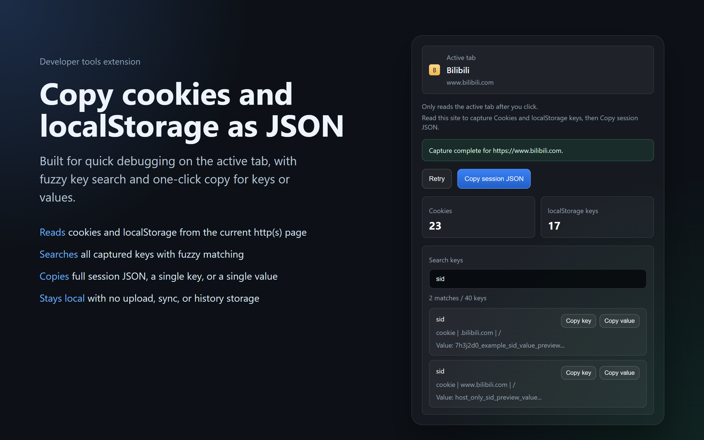

# Cookie LocalStorage Exporter

[English](README.en.md) | [简体中文](README.md)

> Copy cookies and `localStorage` from the active Chrome / Edge tab as formatted JSON, only after you click the extension popup.

Cookie LocalStorage Exporter is a minimal Manifest V3 extension for Chrome and Edge. It reads cookies and `localStorage` from the active `http(s)` tab after you click the popup, then copies the captured payload as formatted JSON.

## Screenshot



## What it does

- Shows the active tab title, host, and favicon in the popup.
- Uses Chrome host permissions for `http(s)` pages so the Cookies API can read parent-domain cookies reliably.
- Reads cookies for the active tab URL and falls back to an apex-style domain lookup when needed.
- Reads `localStorage` from the active tab with `chrome.scripting.executeScript`.
- Copies the result as JSON to the clipboard, with a manual copy fallback if clipboard access fails.
- Shows the cookie query counts in the popup when a page returns no cookies.
- Supports fuzzy key search across cookie names and `localStorage` keys after capture.

## What it does not do

- It does not read data from non-`http(s)` pages such as `chrome://`, `edge://`, `about:blank`, or the extensions gallery.
- It does not export `sessionStorage`.
- It does not save files or trigger any browser file transfer flow.
- It does not read any tab until you click the extension popup.

## Permissions

The extension uses only these required permissions:

- `cookies`: read cookies for the active tab origin.
- `scripting`: run a small script in the active tab to read `localStorage`.
- `activeTab`: inspect the current tab you opened the popup from.

It also declares host permissions for:

- `http://*/*`
- `https://*/*`

Chrome's Cookies API needs host access to return cookies, including parent-domain cookies such as `.example.com`. The extension still reads only the active tab after you click the popup.

## JSON shape

The copied payload has this top-level structure:

```json
{
  "capturedAt": "2026-06-14T04:00:00.000Z",
  "exporter": {
    "name": "Cookie LocalStorage Exporter",
    "version": "0.1.0"
  },
  "tab": {
    "url": "https://example.com/app",
    "title": "Example",
    "host": "example.com"
  },
  "cookies": [],
  "localStorage": {}
}
```

If reading `localStorage` fails, the JSON still contains cookies and an empty `localStorage` object. The warning stays in the popup UI and is not added to the JSON.

## Local install

1. Open Chrome or Edge and go to the extensions page.
2. Enable Developer mode.
3. Choose **Load unpacked**.
4. Select this repository folder: `C:\Users\zhiyu_liu\Documents\cookie-localstorage-exporter`
5. Open any `http(s)` page, then click the extension icon.

## Troubleshooting

### Why are some cookies missing?

Browser cookie access depends on the active tab URL, host permissions, cookie domain, and browser security rules. Parent-domain cookies are queried as a fallback, but some cookies may still be unavailable to extensions.

### Why does it not work on `chrome://` or extension store pages?

Chrome and Edge do not allow normal extensions to inject scripts or read data from internal browser pages, extension gallery pages, or other restricted URLs.

### What should I do if clipboard copy fails?

Use the manual copy fallback shown in the popup. Clipboard access can fail when the browser blocks clipboard writes or the popup loses focus.

## Credits

- Special thanks to the [Linux.do](https://linux.do/) and [V2EX](https://www.v2ex.com/) communities, as well as other community members, for their feedback, discussions, and support.

## Sensitive data warning

Cookies and `localStorage` often contain authentication tokens, account identifiers, and app state. Treat the copied JSON as sensitive material. Do not paste it into chat tools, tickets, or logs unless you intend to disclose that data.

## License

No license file is currently included. Add an explicit license before redistributing, packaging, or accepting contributions.
